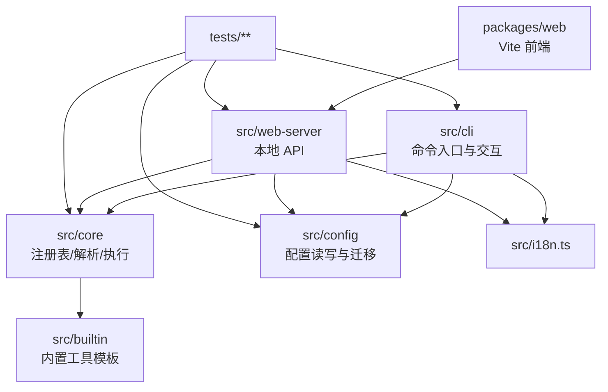

# 项目架构（Structure）

> 本文件是项目级常驻知识的 **structure 层**，记录模块图、依赖规则、ADR 列表、跨模块契约、扩展点与容量边界。
> 由 `specforge init` 首建；后续由 `evolution-retrospect` promote DESIGN § 9 条目更新。
> AI 代理在 `design-explore` 阶段 grep 本文件以对齐既有架构。

---

## 模块图

---

## 依赖规则

| 规则 | 说明 | 违例后果 |
|------|------|---------|
| `src/cli` 可依赖 `core/config/utils/i18n`，不可反向依赖 | 保持入口层薄、领域逻辑集中 | 命令模块膨胀、重复逻辑增加 |
| `src/core` 不依赖 `src/cli` 与 `packages/web` | 核心逻辑可复用于 CLI 与 Web API | 可复用性下降，测试耦合增加 |
| `src/config` 不依赖上层命令模块 | 配置层独立负责迁移与持久化 | 迁移逻辑分散，易出现循环依赖 |
| `packages/web` 仅通过 HTTP API 访问后端 | 前后端边界清晰，便于部署与替换 | 形成跨包隐式耦合 |
| 相对 import 必须显式 `.js` | 保证 ESM 构建和运行一致 | 运行时模块解析失败 |

---

## ADR 列表

| ADR 编号 | 日期 | 决策标题 | 状态 | 备注 |
|----------|------|---------|------|------|
| ADR-001 | 2026-05-11 | Node ESM 工程内相对 import 强制 `.js` 后缀 | accepted | 已沉淀到 `specforge/context/lessons.md` |
| ADR-002 | 2026-05-22 | Release workflow 调整为 build 在 test 前 | accepted | 解决 clean checkout 下 CLI 集成测试依赖 dist 的问题 |

---

## 跨模块契约

| 契约名称 | 涉及模块 | 契约内容 | 变更条件 |
|----------|---------|---------|---------|
| Tool Schema v2 | `config` ↔ `core` ↔ `cli`/`web-server` | `config.json`/`tools.json` 固定 `version: "2"`；`commands` 为 `string[]` | 仅在明确迁移方案下升级 schema |
| Local Web API Auth | `web-server` ↔ `packages/web` | 必须携带 token，且仅允许 `127.0.0.1` 访问 | 安全策略调整或 API 网关替换 |
| Operation Resolve/Execute | `core/resolver` ↔ `core/executor` ↔ `cli` | 先解析 operation，再执行命令链并返回结构化结果 | 命令执行模型变化（并发/事务） |
| I18n Keys | `src/i18n.ts` ↔ `packages/web/src/i18n.ts` | `en` 与 `zh-CN` 双语键集需保持语义一致 | 新增语言或重构文案系统 |

---

## 扩展点

| 扩展点 | 所在路径 | 扩展方式 | 约束 |
|--------|---------|---------|------|
| 用户自定义工具 | `~/.fastcli/tools.json` | 新增 tool entry 和 operation 命令链 | `id` 唯一且匹配正则；source 固定 user |
| 内置工具模板 | `src/builtin/tools.ts` | 在源码中增加 builtin 定义 | 不得由用户配置覆盖源码定义来源 |
| Web 编辑器 UI | `packages/web/src/main.tsx` | 扩展表单、预览、冲突处理交互 | 仅通过本地 API 持久化 |
| i18n 文案 | `src/i18n.ts`、`packages/web/src/i18n.ts` | 新增键值或语言字典 | 代码实体不可翻译，键名需稳定 |

---

## 容量边界

| 边界项 | 当前值 | 上限 | 触发后果 | 备注 |
|--------|-------|------|---------|------|
| Node 运行时版本 | >=18 | 小于 18 不支持 | CLI 无法运行 | 与 `engines.node` 保持一致 |
| 发布入口 | tag `v*` | 非 tag push 不触发 | 不会自动发布 npm/release | release workflow 约束 |
| 配置 schema 版本 | 2 | 非 2 需迁移或拒绝 | 配置读取失败/兼容性风险 | `reader.ts` 有迁移与拒绝逻辑 |
| Web 服务监听范围 | 127.0.0.1 | 非本地回环禁止 | 安全风险增加 | API 层显式阻断 |
