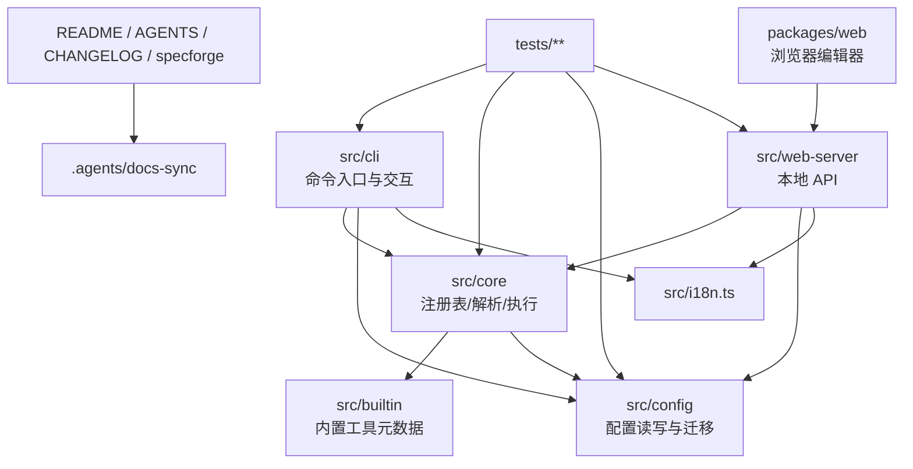

# 项目架构

> 本文件记录 fastcli 的模块图、依赖规则、跨模块契约、扩展点和容量边界。

## 模块图

## 依赖规则

| 规则 | 说明 | 违例后果 |
|------|------|----------|
| `src/cli` 可依赖 `core/config/utils/i18n`，不可反向依赖 | CLI 是入口层，领域逻辑不应知道 CLI 表现层 | 命令模块膨胀，测试耦合增加 |
| `src/core` 不依赖 `src/cli`、`src/web-server` 或 `packages/web` | 核心逻辑应被 CLI 与 Web API 复用 | 复用性下降 |
| `src/config` 不依赖上层命令模块 | 配置迁移和持久化必须集中 | 循环依赖和迁移分散 |
| `packages/web` 仅通过 HTTP API 访问后端 | 前后端边界清晰 | 隐式跨包耦合 |
| `.agents/docs-sync` 不参与运行时构建 | docs-sync 是代理工作流资产 | 运行包体混入开发流程文件 |
| 相对 import 必须显式 `.js` | Node ESM 运行时要求 | `ERR_MODULE_NOT_FOUND` |

## ADR 列表

| ADR 编号 | 日期 | 决策标题 | 状态 | 备注 |
|----------|------|----------|------|------|
| ADR-001 | 2026-05-11 | Node ESM 工程内相对 import 强制 `.js` 后缀 | accepted | 见 `specforge/context/lessons.md#l-001` |
| ADR-002 | 2026-05-22 | Release workflow 调整为 build 在 test 前 | accepted | clean checkout 下 CLI 集成测试依赖 `dist` |
| ADR-003 | 2026-05-22 | 公开文档通过 docs-sync state 做增量同步 | accepted | `.docs-sync-state.json` 是同步基线事实来源 |

## 跨模块契约

| 契约名称 | 涉及模块 | 契约内容 | 变更条件 |
|----------|----------|----------|----------|
| Tool Schema v2 | `config` <-> `core` <-> `cli` / `web-server` | `config.json` / `tools.json` 固定 `version: "2"`；operation 值为 `string[]` | 仅在明确迁移方案下升级 |
| Builtin Tool Boundary | `src/builtin` <-> `src/core` | 内置工具只声明元数据；命令由 package manager 模板生成 | 新增包管理器或内置工具字段 |
| Operation Resolve/Execute | `resolver` <-> `executor` <-> `cli` | 先解析变量，再打印命令链，再确认和执行 | 执行模型变化 |
| Local Web API Auth | `web-server` <-> `packages/web` | API 只接受本地回环请求和 token | 安全策略调整 |
| Web Write Conflict | `web-server` <-> `packages/web` | 写入 `config` / `tools` 必须携带 `If-Match` | 冲突策略变化 |
| I18n Keys | `src/i18n.ts` <-> `packages/web/src/i18n.ts` | `en` / `zh-CN` 键集语义对等 | 新增语言或文案系统重构 |
| Docs Sync Baseline | `.docs-sync-state.json` <-> tracked docs | 文档更新基于 `last_sync_sha..HEAD`，完成后推进基线 | docs-sync schema 变更 |

## 扩展点

| 扩展点 | 所在路径 | 扩展方式 | 约束 |
|--------|----------|----------|------|
| 用户自定义工具 | `~/.fastcli/tools.json` | 新增 tool entry 与 operation 命令链 | name 唯一；id 自动生成且匹配正则 |
| 内置工具 | `src/builtin/tools.ts` | 增加 `BuiltinSpec` 条目 | npm 包名和 tags 必须真实 |
| 包管理器模板 | `src/core/builtin-templates.ts` | 为新的 `packageManager` 增加模板 | 需要 config schema 和文档同步 |
| CLI 子命令 | `src/index.ts`, `src/cli/commands/**` | 新增 citty command | README 命令参考和测试同步 |
| 可视化编辑器 | `packages/web/src/main.tsx` | 扩展表单、预览、冲突处理 | 只能通过本地 API 持久化 |
| i18n 文案 | `src/i18n.ts`, `packages/web/src/i18n.ts` | 新增 key 或语言 | 代码实体不翻译 |
| 文档同步规则 | `.agents/docs-sync` | 修改契约或 state schema | CHANGELOG 和 specforge 同步 |

## 容量边界

| 边界项 | 当前值 | 上限 / 下限 | 触发后果 |
|--------|--------|-------------|----------|
| Node 运行时 | >=18 | 小于 18 不支持 | CLI 无法保证运行 |
| 配置 schema | `"2"` | 非 2 需迁移或拒绝 | 配置读取失败或兼容风险 |
| Web 监听范围 | `127.0.0.1` | 非回环禁止 | 安全风险 |
| Web 默认端口范围 | 3000-3100 | 全忙则报错 | 用户需指定其他端口 |
| 用户工具 id | 1-64 字符 | `^[a-z0-9][a-z0-9-]*$`，由 name 自动生成 | add/API 校验失败 |
| JSON body | 1 MB | 超出 Express limit | API 请求失败 |
| 发布入口 | tag `v*` | 非 tag push 不发布 | 不触发 npm 发布 |
| docs-sync state schema | `1` | 非兼容升级需契约更新 | 文档同步基线不可信 |

## 运行时数据流

1. CLI 或 Web API 读取 `config.json` 与 `tools.json`。
2. Registry 生成内置工具命令，并合并用户工具。
3. Resolver 根据 tool id + operation 产出命令链并替换变量。
4. CLI 打印命令链，必要时确认。
5. Executor 将命令链交给系统 shell 顺序执行，返回退出码与失败步骤。

可视化编辑器写入路径额外包含 ETag 校验、写入队列和 JSON 原子写入。
